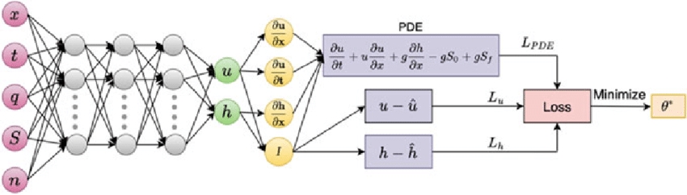

<!-- Back to top -->

<!-- PROJECT LOGO -->
 

  

  <h3 align="center">PINNs Teaching</h3>

  

    <a href="https://github.com/cdenq/pinns-teaching-uis">Report Bug</a>
  

## About
You can find the most updated version of this repo on [the ISAS Hub organization page](https://github.com/ISAS-Hub/hands-on-learning-pinns). This repo is no longer maintained and is kept only for redirecting purposes.